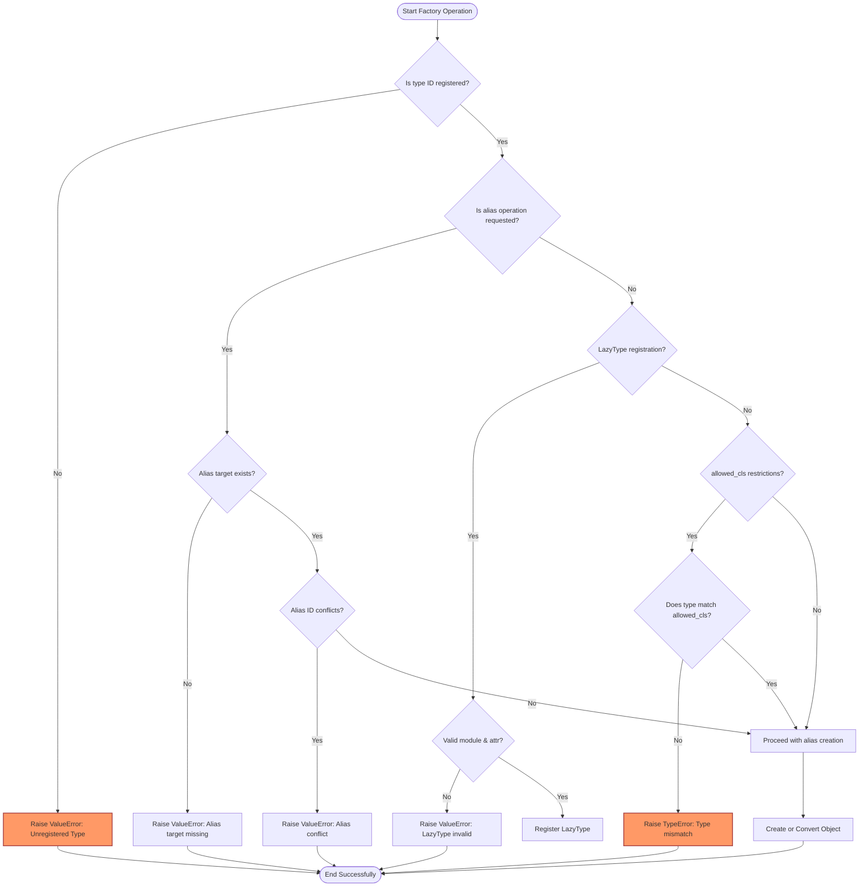

# Error Handling & Troubleshooting

Understanding the error landscape of *Dessine-moi*’s factory operations equips you to debug and resolve integration issues swiftly and confidently. This page enumerates the common errors and exceptions you may encounter while registering types, creating objects, converting dictionaries, or configuring lazy loading. Alongside status codes and messages, we provide clear guidance on how to handle these errors effectively to maintain a robust factory workflow.

---

## Common Error Categories

*Dessine-moi* errors primarily stem from misuse or misconfiguration of the factory’s type system or object creation methods. Below are the prevalent categories:

- **Unregistered Type Errors**: Occur when attempting to create or convert an object for a type ID not present in the factory’s registry.
- **Type Registration Conflicts**: Triggered by attempts to register duplicate type IDs without permission to overwrite.
- **Type Aliasing Failures**: Arise when aliasing a non-existent or already aliased type.
- **Lazy Type Misconfigurations**: Result from invalid lazy type registrations such as empty names or missing type IDs.
- **Conversion Restrictions**: Emerge when using `allowed_cls` restrictions that fail type compatibility checks.

---

## Error Scenarios and Handling Patterns

### 1. Unregistered Type ID

**Scenario:**
You attempt to create or convert an object with a type ID that has not been registered.

**Error Raised:**
```python
ValueError: <type_id> is not a registered type
```

**When It Happens:**
- Calling `Factory.create()` with an unknown type ID.
- Calling `Factory.convert()` on a dictionary specifying a missing type.

**Recommended Handling:**
- Confirm the type is registered before creation.
- Use exception handling to provide fallback logic or clear error messages.

**Example:**
```python
try:
    obj = factory.create('unknown_type')
except ValueError as e:
    print(f'Error: {e}')
    # Register type or handle fallback
```

### 2. Registration ID Conflicts

**Scenario:**
You attempt to register a new type with an existing type ID without allowing overwrite.

**Error Raised:**
```python
ValueError: Type ID '<type_id>' already registered
```

**When It Happens:**
- Using `Factory.register()` when type ID exists and `overwrite_id=False`.

**Recommended Handling:**
- Use the `overwrite_id=True` flag if you intend to replace an existing registration.
- Validate registry existence and intended behavior before registration.

### 3. Alias Registration Issues

**Scenario:**
Trying to create an alias for a type ID that does not exist, or aliasing over an existing alias.

**Error Raised:**
```python
ValueError: Cannot alias non-existing type '<original_type_id>'
ValueError: Alias '<alias_id>' already in use
```

**When It Happens:**
- Calling `Factory.alias()` with improper parameters.

**Recommended Handling:**
- Ensure the original type ID is registered before aliasing.
- Verify that aliases do not conflict with existing IDs.

### 4. Lazy Type Registration Errors

**Scenario:**
Registering a lazy type with an empty name or without specifying a type ID.

**Error Raised:**
```python
ValueError: LazyType module or attribute name cannot be empty
ValueError: Registration requires a type ID
```

**When It Happens:**
- Registering lazy types improperly.

**Recommended Handling:**
- Provide valid module and attribute names for `LazyType`.
- Always specify a valid `type_id` when registering lazy types.

### 5. Conversion with Allowed Class Restrictions

**Scenario:**
Using an `allowed_cls` parameter in `Factory.create()` or `Factory.convert()` that does not match the target or instantiated type.

**Error Raised:**
```python
TypeError: '<type_id>' does not reference allowed type <allowed_class> or its subtypes
```

**When It Happens:**
- Type mismatch between requested and allowed types during creation or conversion.

**Recommended Handling:**
- Check your `allowed_cls` parameter matches the expected type hierarchy.
- Use `isinstance` or type checks as pre-validation.

---

## Troubleshooting Workflow

To efficiently diagnose and fix errors during factory operations, follow this workflow:

<Steps>
<Step title="Verify Type Registration">
Check if the type ID involved is successfully registered in the factory’s registry (`factory.registry`).
</Step>
<Step title="Check for Aliasing Conflicts">
Ensure aliases are correctly linked and not shadowing existing type IDs.
</Step>
<Step title="Validate Lazy Type Definitions">
Confirm lazy type constructors have valid module and attribute names.
</Step>
<Step title="Examine Conversion Restrictions">
Review usages of `allowed_cls` and ensure they allow the target type.
</Step>
<Step title="Handle Exceptions Gracefully">
Wrap calls to `create` or `convert` in try-except blocks to catch and properly respond to `ValueError` and `TypeError`.
</Step>
</Steps>

---

## Best Practices for Robust Integration

- **Register all expected types at startup** to avoid missing registration errors at runtime.
- **Use `overwrite_id` judiciously** when re-registering to avoid accidental overrides.
- **Employ aliases carefully** to maintain a clear and conflict-free registry.
- **Favor explicit error handling** around factory methods for graceful degradation.
- **Leverage lazy types** for optional or deferred module imports, confirming correctness beforehand.

---

## Example: Handling Failed Object Creation Gracefully

```python
from dessinemoi import Factory

factory = Factory()

@factory.register
define_sheep_class():
    import attrs

    @attrs.define
    class Sheep:
        _TYPE_ID = 'sheep'
        wool: str = 'some'
    return Sheep

try:
    # Attempt creation of a non-registered type
    ram = factory.create('ram')
except ValueError as err:
    print(f"Creation failed: {err}")
    # Register or fallback logic
    # Example: register 'ram' type or handle missing type gracefully
```

---

## Relation to Other Documentation

This error handling and troubleshooting guide complements the core factory API and usage documentation:

- For detailed factory registration, see [Type Registration and Mapping](/api-reference/factory-core-api/type-registration).
- For dictionary-driven object creation and converter behavior, refer to [Object Creation from Dictionaries](/api-reference/factory-core-api/object-creation-from-dict).
- For factory customization and advanced behaviors, consult [Customizing the Factory](/api-reference/advanced-and-integration/custom-factory-behaviors).
- If installation or setup issues arise, review the [Troubleshooting and Common Issues]( /getting-started/first-steps/troubleshooting) guide.

<Note>
Handling errors proactively ensures your integration with *Dessine-moi* remains resilient and maintainable, enabling dynamic and reliable object creation workflows.
</Note>

---

## Appendix: Summary of Key Exception Types

| Exception Type | Raised When | Suggested Handling |
|----------------|-------------|-------------------|
| `ValueError` | Unknown type ID or invalid registration/aliasing operations | Validate registrations; try-except blocks with corrective action |
| `TypeError` | Violations of `allowed_cls` restrictions during create/convert | Review type constraints and adjust class hierarchies |


---

## Diagram: Factory Error Handling Flow



---

<Source url="https://github.com/rayference/dessinemoi" branch="main" paths={[{"path": "tests/test_dessinemoi.py", "range": "20-74"}]} />
