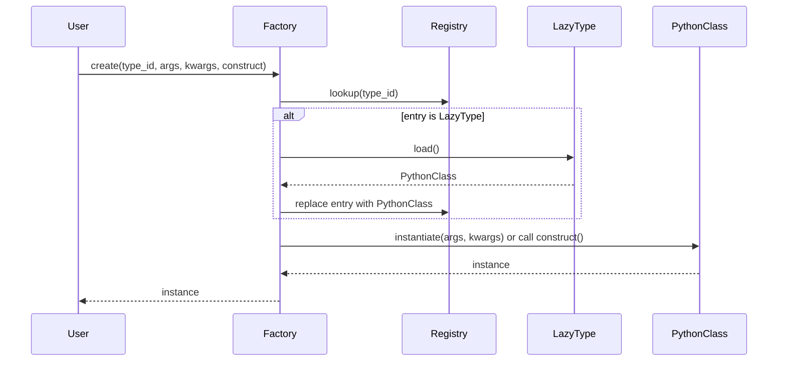

# Factory Class Reference

## Overview

The **Factory** class is the cornerstone of *Dessine-moi*'s dynamic object creation capabilities. It centralizes the factory pattern to empower you to register Python types with string identifiers, create instances of those types with flexible arguments, and convert nested dictionaries into rich, fully typed Python object graphs.

This page details how to leverage the Factory class for type registration, creating objects from type IDs or dictionaries, managing aliases, and customizing conversion and creation behavior. You will find clear usage patterns, method references, practical code examples, and tips for extending the factory to fit your complex workflows.

---

## Why Use the Factory?

Imagine you need to build diverse Python objects dynamically from configuration files, JSON payloads, or arbitrary nested dictionaries. The Factory lets you map human-friendly string IDs to Python classes and then instantiate them automatically from data — all while handling nested object graphs with ease.

By registering your types centrally in a Factory instance, you modularize your code, reduce boilerplate object creation, and seamlessly integrate with other Python ecosystems such as *attrs*.

---

## Core Concepts

- **Type ID**: A unique string key registered to one Python class, used to identify the class in object creation.
- **Registry**: The Factory's internal dictionary linking type IDs to classes and optional custom dict constructors.
- **Alias**: Alternative type IDs pointing to the same class, allowing flexible referencing.
- **Dict Constructor**: An optional class method name that the Factory calls instead of the default constructor when converting from dictionaries.
- **Lazy Registration**: Defers importing a class type until it is actually instantiated, improving startup efficiency.

---

## Creating a Factory Instance

The usual starting point is to instantiate the factory:

```python
from dessinemoi import Factory

factory = Factory()
```

This instance will hold the registry of your types and provide all creation and conversion operations.

---

## Registering Types

Registering a Python class associates it with a unique type ID in the factory registry. This is essential before you can create or convert objects of that type.

### Basic Registration

```python
import attrs

@attrs.define
class Sheep:
    wool: str = 'some'

factory.register(Sheep, type_id='sheep')
```

Now the factory knows that the ID `'sheep'` corresponds to the `Sheep` class.

### Using Decorator Form

```python
@factory.register  # decorator usage
@attrs.define
class Lamb(Sheep):
    _TYPE_ID = 'lamb'
```

If you provide no arguments to `register()`, it uses the class's `_TYPE_ID` attribute as the type ID by default.

### Aliases

You can add additional aliases to point to the same class type:

```python
factory.alias('sheep', 'mouton')
```

Or during registration:

```python
factory.register(Sheep, type_id='sheep', aliases=['mouton'])
```

### Overwriting Registrations

By default, attempting to register a type ID twice raises an error. You can override this by specifying:

```python
factory.register(SomeClass, type_id='sheep', overwrite_id=True)
```

### Lazy Type Registration

To avoid importing heavy classes prematurely, register the fully qualified class path as a string:

```python
factory.register('datetime.datetime', type_id='datetime')
```

The class is only imported when you create or convert an instance of that type.

---

## Creating Objects

Once types are registered, create instances using `create()`.

### Basic Creation

```python
merino = factory.create('sheep', kwargs={'wool': 'lots'})
print(merino)  # Sheep(wool='lots')
```

You can provide positional arguments and keyword arguments:

```python
factory.create('sheep', args=('extra_wool',))
```

### Restricting Allowed Types

To ensure only certain subclasses are created, use `allowed_cls`:

```python
factory.create('sheep', allowed_cls=Sheep)
```

Passing a type that is not allowed will raise `TypeError`.

### Using Class Method Constructors

You can specify a named constructor method with `construct`:

```python
@attrs.define
class Sheep:
    wool: str

    @classmethod
    def unsheavable(cls):
        return cls(wool='none')

factory.register(Sheep, type_id='sheep', dict_constructor='unsheavable')

unshorn = factory.create('sheep', construct='unsheavable')
```

---

## Converting Dictionaries to Objects

The Factory's `convert()` method is designed to transform nested dictionaries with a `type` key into typed Python objects.

### Basic Conversion

```python
obj = factory.convert({'type': 'sheep', 'wool': 'soft'})
print(obj)  # Sheep(wool='soft')
```

If the input is not a dictionary, it is returned unchanged.

### Custom Dict Constructor

If a `dict_constructor` is registered for the class, `convert()` will use it instead of the default constructor:

```python
factory.register(Sheep, type_id='sheep', dict_constructor='unsheavable')
obj = factory.convert({'type': 'sheep'})
print(obj.wool)  # 'none'
```

### Allowed Types Enforcement

You can restrict conversion to certain types:

```python
factory.convert({'type': 'sheep'}, allowed_cls=Lamb)  # Raises TypeError
```

### As an attrs Converter

You can create converter functions for use in attrs fields:

```python
converter = factory.convert(allowed_cls=Lamb)
value = converter({'type': 'lamb'})
```

---

## Managing Aliases

Aliases allow you to assign multiple type IDs to the same class.

- Use `alias(original_id, new_alias)` to add an alias.
- Aliases must not collide with existing IDs.
- Aliases simplify reference flexibility across different naming conventions.

```python
factory.alias('sheep', 'mouton')
```

---

## Extending the Factory

You can subclass the Factory to customize its conversion and creation logic, for example to support different dictionary formats or complex workflows.

```python
class CustomFactory(Factory):
    def convert(self, value, **kwargs):
        # Custom conversion logic
        pass

custom_factory = CustomFactory()
```

---

## Best Practices & Tips

- Always register types before creating or converting objects.
- Use descriptive and unique `type_id` strings to avoid collisions.
- Prefer aliases to maintain backward compatibility when renaming types.
- Leverage lazy registration for heavy or optional dependencies.
- Use `dict_constructor` for special factory methods that encapsulate creation logic.
- Restrict `allowed_cls` parameters to enforce type safety.

---

## Common Pitfalls

- Forgetting to register a class before conversion leads to `ValueError`.
- Using positional arguments with classes that lack matching constructors.
- Mishandling aliases causing registration conflicts.
- Expecting `convert()` to work with non-keyword init classes.
- Registering lazy types without specifying an ID.

---

## Factory Class Method Reference

### `Factory.register(cls_or_str, *, type_id=None, aliases=None, dict_constructor=None, overwrite_id=False, allow_lazy=True)`

Registers a Python class or a lazy type string with the factory.

- **cls_or_str**: Python class or fully qualified class string.
- **type_id**: Unique identifier string. Defaults to `_TYPE_ID` attribute if not provided.
- **aliases**: Optional list of string aliases for the type.
- **dict_constructor**: Name of class method to call upon dictionary conversion.
- **overwrite_id**: If True, overwrites existing registration with the same ID.
- **allow_lazy**: If False, disables lazy registration; class must be imported eagerly.

Returns the registered class.

Raises `ValueError` on conflicts or invalid registrations.

---

### `Factory.alias(existing_id, alias_id)`

Adds `alias_id` as an alias of an existing registered type `existing_id`.

Raises `ValueError` if the original ID is not registered, or if `alias_id` already exists.

---

### `Factory.create(type_id, *, args=(), kwargs=None, allowed_cls=None, construct=None)`

Creates an instance of the registered type identified by `type_id`.

- **args**: Positional arguments to the class constructor.
- **kwargs**: Keyword arguments to the class constructor.
- **allowed_cls**: Restricts creation to subtypes of this class or tuple of classes.
- **construct**: Optional class method name to use as constructor.

Raises `ValueError` if `type_id` is not registered.
Raises `TypeError` if created type is not allowed.

---

### `Factory.convert(value, *, allowed_cls=None)`

Converts a dictionary with a `type` key to an instance of the corresponding class.

- If `value` is not a dictionary, returns it unchanged.
- If the type is not registered, raises `ValueError`.
- Enforces `allowed_cls` if provided.

This method can also be used as an `attrs` converter.

---

### `Factory.registry`

A dictionary mapping type IDs and aliases to `FactoryRegistryEntry` objects, which hold:

- `cls`: The registered Python class or a `LazyType` proxy.
- `dict_constructor`: Optional dict constructor method name.

---

## Practical Code Examples

```python
import attrs

@factory.register
@attrs.define
class Sheep:
    wool: str = 'some'

@factory.register(type_id='ram')
@attrs.define
class Ram(Sheep):
    name: str = 'Gorki'

# Create instance normally
sheepy = factory.create('sheep', kwargs={'wool': 'extra'})

# Using construct class method
@attrs.define
class SpecialSheep:
    wool: str

    @classmethod
    def special(cls):
        return cls(wool='special')

factory.register(SpecialSheep, type_id='special_sheep', dict_constructor='special')

instance = factory.convert({'type': 'special_sheep'})

print(instance.wool)  # Output: 'special'
```

---

## Troubleshooting

<AccordionGroup title="Common Issues and Solutions">
<Accordion title="TypeNotRegisteredError">

**Symptom:** Attempting to create or convert an object with an unregistered type ID.

**Solution:** Ensure the class is registered before creating or converting. Check spelling and alias registrations.

</Accordion>
<Accordion title="Overwrite Registration Error">

**Symptom:** Error when re-registering a type ID.

**Solution:** Use `overwrite_id=True` explicitly if overwriting is intended. Otherwise, check for accidental duplicate registrations.

</Accordion>
<Accordion title="Lazy Type Use Issues">

**Symptom:** Lazy type registered as string but missing `type_id`.

**Solution:** Always provide a `type_id` when registering lazy types. Avoid allowing lazy registration without IDs.

</Accordion>
<Accordion title="Constructor Argument Mismatch">

**Symptom:** Errors due to passing positional or keyword arguments that the constructor does not accept.

**Solution:** Verify constructor signatures, prefer keyword-only fields (e.g., with attrs), or use class method constructors with `construct` parameter.

</Accordion>
</AccordionGroup>

---

## Diagram: Factory Object Creation Flow



---

## Next Steps

- Learn how to register types and convert dictionaries in the [Registering Types and Building Object Trees guide](https://dessinemoi.readthedocs.io/en/latest/guides/getting-started/registering-types.html)
- Explore customizing factory behavior with [Customizing Factories for Complex Workflows](https://dessinemoi.readthedocs.io/en/latest/guides/advanced-usage/customizing-factories.html)
- Deepen your understanding by reviewing the [attrs Integration guide](https://dessinemoi.readthedocs.io/en/latest/guides/advanced-usage/attrs-integration.html)
- Review common issues in [Performance Optimization & Troubleshooting](https://dessinemoi.readthedocs.io/en/latest/guides/advanced-usage/performance-and-troubleshooting.html)

---

## Source

<Source url="https://github.com/rayference/dessinemoi" branch="main" paths={[{"path": "src/dessinemoi/_core.py", "range": "10-150"}]} />
