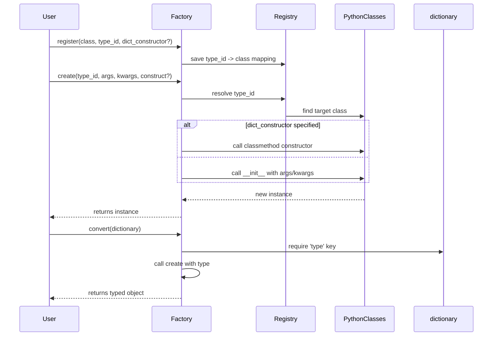

# Type Registration & Customization

This page explains how to register your own Python classes with the Dessine-moi factory for dynamic object creation, including how attributes map during registration and how to customize the factory behavior for advanced or nested object models.

---

## 1. Introduction to Type Registration

Before the factory can create instances of your custom classes, you must register them with unique IDs. This mapping allows the factory to identify which Python class corresponds to a type ID found in dictionaries or when creating objects programmatically.

Registration supports multiple conveniences:

- **Direct registration** by providing the class and an explicit type ID.
- **Decorator-style registration** placed on top of a class definition.
- Automatic ID detection via a `_TYPE_ID` class attribute when using the decorator style.
- Aliases to register multiple type IDs for the same class.
- Optionally associating a dedicated dictionary constructor method for specialized creation during dictionary conversion.


### Why Register Types? 

Registering types lets the factory transform raw nested dictionaries (often parsed from JSON, YAML, or configs) into fully-typed, rich Python objects effortlessly, supporting dynamic and decoupled application designs.

## 2. Registering Python Types with the Factory

### 2.1 Basic Registration

You can register a class with a unique type ID as follows:

```python
from dessinemoi import Factory
import attrs

factory = Factory()

@attrs.define
class Sheep:
    wool: str = "some"

factory.register(Sheep, type_id="sheep")
```

Here, `Sheep` is now registered to the factory under the ID `"sheep"`.

---

### 2.2 Decorator-Style Registration

You can use the registration call as a class decorator. If the class defines a `_TYPE_ID` attribute, that is used as the type ID automatically:

```python
@factory.register
@attrs.define
class Lamb(Sheep):
    _TYPE_ID = "lamb"
```

This form is concise and makes the registration explicit yet clean.

---

### 2.3 Handling Conflicts and Overwrites

By default, re-registering a type ID will raise an error to prevent accidental overwrites. If you intend to replace a registration, set:

```python
factory.register(MyClass, type_id="myid", overwrite_id=True)
```

Use this cautiously to avoid confusing behavior.

---

### 2.4 Aliases for Types

Register multiple IDs for the same class using `aliases` argument:

```python
factory.register(Sheep, type_id="sheep", aliases=["mouton"])
```

Or register an alias after the fact:

```python
factory.alias("sheep", "mouton")
```

Aliases increase flexibility when input data might use different type IDs for the same conceptual object.

## 3. Instantiating Registered Types

Use the factory's `create` method to instantiate an object by its type ID:

```python
merino = factory.create("sheep", kwargs={"wool": "lots"})
print(merino)  # Output: Sheep(wool='lots')
```

You can also restrict creation to a subset of classes using `allowed_cls` for security or domain constraints:

```python
factory.create("sheep", allowed_cls=Sheep)  # works
factory.create("sheep", allowed_cls=Lamb)  # raises TypeError
```

---

### 3.1 Advanced: Selecting a Classmethod Constructor

If your class defines alternative constructors as class methods, use the `construct` keyword to specify which constructor to use:

```python
@classmethod
def unsheavable(cls):
    return cls(wool="none")

Sheep.unsheavable = unsheavable

factory.create("sheep", construct="unsheavable")  # returns Sheep(wool='none')
```

This enables flexible and domain-specific instantiation policies.

## 4. Dictionary-Based Object Conversion

The factory can convert dictionaries into typed object instances via its `convert` method. The dictionary must include a `type` key with the registered type ID:

```python
obj = factory.convert({"type": "sheep", "wool": "lots"})
print(obj)  # Sheep(wool='lots')
```

- Non-dictionary input is returned unchanged.
- If the registered type provides a dict constructor method (set during registration), it will be used instead of the default constructor.
- You can restrict conversion to allowed types with `allowed_cls`.

---

### 4.1 Using a Dict Constructor

You may want to register a class method constructor dedicated to dictionary-based creation:

```python
@classmethod
def merino(cls):
    return cls(wool="lots")

factory.register(Sheep, type_id="sheep", dict_constructor="merino")
obj = factory.convert({"type": "sheep"})  # Calls Sheep.merino()
```

This lets you encapsulate complex instantiation logic triggered by dictionary input.

## 5. Lazy Type Registration

To optimize import times or handle rarely used types, you can register them lazily by providing the full module path as a string:

```python
factory.register("datetime.datetime", type_id="datetime")
```

The actual import happens upon object creation, minimizing upfront cost. The factory updates the registry entry with the actual type once loaded.

---

## 6. Customizing Factory Behavior

If the built-in registration and conversion mechanics don’t fit your needs, extend the `Factory` class by subclassing and overriding methods such as `convert` or `create`.

Use this to:

- Change how dictionaries are interpreted.
- Support positional constructor arguments or alternate dictionary keys.
- Implement additional validation or logging.
- Handle deeply nested or domain-specific models with complex init logic.

Example:

```python
from dessinemoi import Factory

class MyFactory(Factory):
    def convert(self, value, **kwargs):
        # Custom conversion logic here
        pass
```

Refer to [Customizing Factories for Complex Workflows](https://dessinemoi.readthedocs.io/en/latest/guides/advanced-usage/customizing-factories.html) for an in-depth guide.

## 7. Troubleshooting & Best Practices

- **ID Uniqueness**: Ensure each type ID is unique unless you explicitly allow overwriting.
- **Constructor Compatibility**: For dictionary conversion, constructors should accept keyword arguments to map dictionary keys.
- **Aliases**: Use them thoughtfully when multiple type identifiers should create the same class.
- **Lazy Registration**: Use it for rarely-used or large dependencies but verify the import path is correct.
- **Dict Constructor Validity**: If specifying a dict constructor, ensure it is a valid class method or it will raise errors.

## 8. Summary Diagram



---

## 9. Related Documentation & Next Steps

- [Factory class API Reference](/api-reference/core-api/factory-class.html) — detailed API of the Factory class
- [Registering Types and Building Object Trees](/guides/getting-started/registering-types.html) — practical usage guide
- [Creating Objects from Dictionaries](/guides/getting-started/dict-to-object.html) — dictionary to object walkthrough
- [Customizing Factories for Complex Workflows](/guides/advanced-usage/customizing-factories.html) — advanced factory extension

Explore these resources to deepen your understanding and master efficient type registration and factory customization in Dessine-moi.

---

## 10. Source Link

<Source url="https://github.com/rayference/dessinemoi" branch="main" paths={[{"path": "src/dessinemoi/__init__.py", "range": "1-81"}]} />
