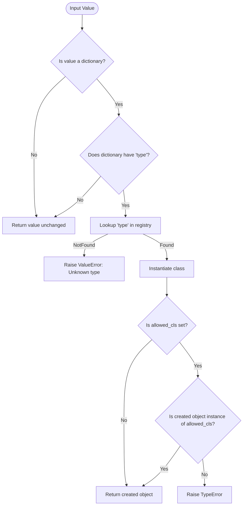

# Object Creation from Dictionaries

The ability to create structured Python objects dynamically from nested dictionaries is at the heart of *Dessine-moi*'s design. This page serves as a comprehensive guide to leveraging the Factory class’s core functionality: converting dictionaries — often derived from JSON or similar data sources — directly into typed Python objects with full control over recursion, default handling, and custom construction.

---

## Introduction

Imagine receiving deeply nested JSON data representing a complex domain model — animals, plants, or configuration trees — and wanting to transform it instantly into a hierarchy of Python objects. This capability unlocks seamless integration between dynamic input data and strongly typed Python applications.

With *Dessine-moi*, you use the `Factory.convert` method to turn a dictionary into the appropriate registered Python instance by inspecting the dictionary's `type` field. This page dives into how this works, demonstrates practical usage, and highlights best practices to help you master this essential feature.

---

## Core Workflow: Dynamic Object Creation from Dictionaries

### Step 1: Register Python Types

Before converting dictionaries, define and register your Python classes in a `Factory` instance, each associated with a unique string type ID. Registration signals to the factory how to interpret dictionary `type` entries.

```python
import attrs
import dessinemoi

factory = dessinemoi.Factory()

@factory.register
def Sheep:
    _TYPE_ID = 'sheep'
    wool: str = attrs.field(default='some')
```

### Step 2: Prepare Your Dictionary Data

Your dictionary input must include a `type` attribute matching a registered ID to identify the class to instantiate.

```python
input_data = {'type': 'sheep', 'wool': 'thick and curly'}
```

### Step 3: Convert Dictionary to Object

Invoke the factory’s `convert` method to transform your dictionary into a typed object. Non-dictionary inputs pass through unchanged.

```python
sheep = factory.convert(input_data)
print(sheep)  # Sheep(wool='thick and curly')
```

### Behind the Scenes

- The factory reads the `type` key to dispatch to the matching registered class.
- By default, the class’s constructor is called with the dictionary’s remaining keys as keyword arguments.
- If a custom `dict_constructor` is registered, it is invoked instead.
- The conversion works recursively when nested objects are also dictionaries with `type` keys.

---

## Detailed API: `Factory.convert`

```python
Factory.convert(self, value, *, allowed_cls=None) -> Any
```

- **`value`**: The input to convert. If not a dictionary, returned as is.
- **`allowed_cls`** *(optional)*: A class or tuple of classes that restrict which types can be created. If the resolved type is not a subtype of this, a `TypeError` is raised.

### Behavior

- Returns the original `value` if it is not a dictionary.
- If `value` is a dictionary with a `type` key, looks up the corresponding class in the registry.
- Raises `ValueError` if the `type` is not registered.
- Instantiates the class using:
  - The registered dict constructor method if present.
  - Otherwise, calls the class constructor with the dictionary items as keyword arguments.
- Validates type against `allowed_cls` if specified.

### Example Usage

```python
@factory.register
def Lamb(Sheep):
    _TYPE_ID = 'lamb'

# Simple create from dictionary
obj = factory.convert({'type': 'sheep', 'wool': 'fine'})
assert isinstance(obj, Sheep)

# Restrict to Lamb or subtypes
converter = factory.convert(allowed_cls=Lamb)
obj_lamb = converter({'type': 'lamb'})
```

---

## Handling Recursion and Nested Structures

To convert trees of nested dictionaries, ensure every nested dictionary includes a `type` key corresponding to a registered type. The factory’s conversion recursively instantiates deeply nested objects.

```python
@factory.register
@attrs.define
class Flock:
    sheep: list[Sheep] = attrs.field(factory=list)

data = {
    'type': 'flock',
    'sheep': [
        {'type': 'sheep', 'wool': 'thick'},
        {'type': 'lamb', 'wool': 'soft'}
    ]
}

flock = factory.convert(data)
print(flock.sheep[0])  # Sheep(wool='thick')
```

### Tip

While the factory supports recursive data, you must manually ensure nested dictionaries properly include `type` keys to trigger correct conversions.

---

## Custom Dictionary Constructors

Some classes may require bespoke construction logic. Use the `dict_constructor` parameter during registration to specify a class method that handles dictionary conversions.

```python
@attrs.define
class Sheep:
    wool: str

    @classmethod
    def merino(cls):
        return cls(wool='lots')

factory.register(Sheep, type_id='sheep', dict_constructor='merino')
obj = factory.convert({'type': 'sheep'})
print(obj.wool)  # 'lots'
```

This mechanism is especially useful for classes with complex initialization or for default instances.

---

## Best Practices and Common Pitfalls

- Always register all types that your dictionaries might reference.
- Nested dictionaries must have `type` keys to convert correctly; otherwise, they remain dictionaries.
- Provide descriptive type IDs that clearly identify classes.
- When using `dict_constructor`, ensure the method is a class method without required arguments beyond `cls`.
- Use `allowed_cls` in `convert` to enforce stricter typing guarantees.

<Warning>
Omitting the `type` key in input dictionaries will cause the factory to bypass conversion, returning the raw dictionary. This may lead to subtle errors if nested raw dictionaries remain unconverted inside objects.
</Warning>

---

## Troubleshooting Conversion Issues

### Symptom: Unexpected raw dictionaries in objects

Verify that every nested dictionary you expect converted includes a `type` field with a valid registered ID.

### Symptom: `ValueError` complaining about unknown type ID

Check that the type ID in the input dictionary is registered with the factory.

### Symptom: `TypeError` about disallowed class

Ensure that the `allowed_cls` argument, if specified, includes the class corresponding to the type ID.

### Debugging Tips

- Print `factory.registry` to see registered types.
- Use the factory’s `create` method manually to verify instantiation.

---

## Summary Flow Diagram



---

## Additional Resources

- [Factory Class API Reference](/api-reference/factory-core-api/factory-class) — to understand the factory’s full interface
- [Type Registration and Aliasing Guide](/api-reference/factory-core-api/type-registration) — for managing type mappings and aliases
- [Attrs-Compatible Converters](/api-reference/advanced-and-integration/attrs-converters) — using converters within attrs
- [Customizing the Factory](/api-reference/advanced-and-integration/custom-factory-behaviors) — to extend conversion logic
- [Usage Guide: Dictionary-Driven Object Creation](/guides/getting-started/dictionary-object-creation) — practical introduction

---

Harness the power of *Dessine-moi*’s dictionary-driven object creation to transform your data-driven workflows dynamically and reliably. Master these capabilities to seamlessly map complex nested data into rich Python object graphs that power your applications and models.


