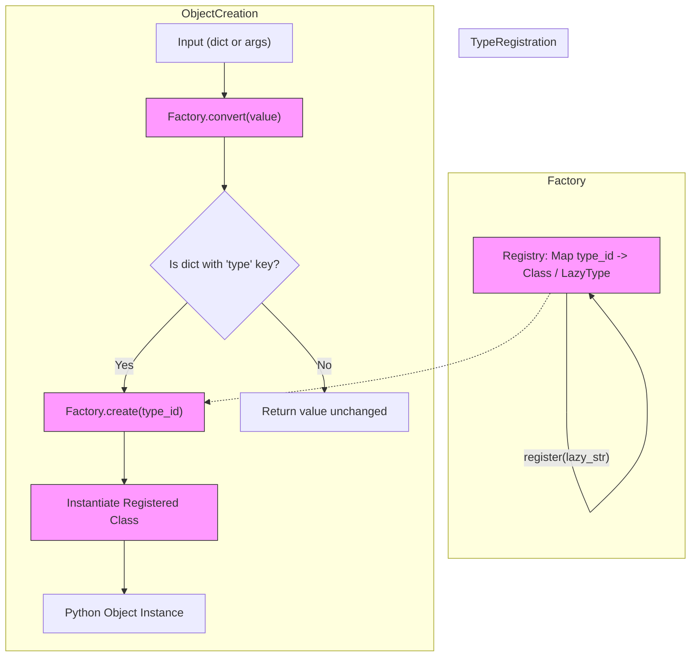

# Type Registration and Mapping

Explore the foundational aspects of how you register and manage Python types within the Dessine-moi Factory. This documentation guides you through extending the factory's supported types, setting up mappings between string identifiers and classes, and crafting custom construction logic. Master these capabilities to adapt the factory to your complex data models and dynamic instantiation needs.

---

## Overview

At the heart of Dessine-moi lies the ability to register Python classes (types) with a **Factory**, associating string identifiers with these classes. This mapping is crucial for dynamically creating objects from dictionaries or other data representations.

This page explains:

- How to register classes with unique type IDs
- Creating aliases for existing type IDs
- Handling lazy type loading to defer imports
- Using custom construction methods
- Managing dictionary-based constructors for flexible instantiation

By mastering these topics, you unlock the power to adapt Dessine-moi to virtually any data-driven Python model.

## Registering Types with the Factory

### Basics of Registration

A fundamental task is associating a Python class with a string type ID in the Factory's registry.

```python
from dessinemoi import Factory
import attrs

factory = Factory()

@attrs.define
class Sheep:
    _TYPE_ID = "sheep"
    wool: str = "some"

# Register the Sheep class, using _TYPE_ID by default
factory.register(Sheep)
```

If you prefer explicit control, specify the `type_id` directly:

```python
factory.register(Sheep, type_id="sheep")
```

### Registration as a Decorator

For convenience and clarity, you can register classes immediately upon declaration without passing the class as an argument:

```python
@factory.register
@attrs.define
class Lamb(Sheep):
    _TYPE_ID = "lamb"
```

When `type_id` is omitted, Dessine-moi uses the class attribute `_TYPE_ID`. Note that the `register` decorator is best placed last (top) in your class declaration stack.

### Overwriting Existing Registrations

By default, registering a type with an already existing ID raises a `ValueError` to prevent accidental overwriting.

If intentional replacement is required, specify:

```python
factory.register(int, type_id="sheep", overwrite_id=True)
```

### Using Custom Dictionary Constructors

If your class requires special construction logic when converting from dictionaries, supply a class method name with `dict_constructor` during registration:

```python
@attrs.define
class Sheep:
    wool: str

    @classmethod
    def merino(cls):
        return cls(wool="lots")

factory.register(Sheep, type_id="sheep", dict_constructor="merino")
```

Now, when `convert` is called with a dictionary containing `type: sheep`, it uses `Sheep.merino()` to build the instance.

## Aliasing Types

Aliases let multiple type IDs point to the same class, expanding flexibility in input data handling.

### Creating Aliases Post Registration

```python
factory.alias("sheep", "mouton")
```

Both `sheep` and `mouton` now resolve to the `Sheep` class.

### Defining Aliases On Registration

You can also define aliases upfront:

```python
factory.register(Sheep, type_id="sheep", aliases=["mouton"])
```

### Restrictions

- Aliasing a non-existing type raises an error.
- Assigning an alias already in use is prohibited unless the original alias is removed.

## Lazy Type Registration

Sometimes you want to register a type without immediate import, deferring it until the factory actually creates an instance.

This is useful to reduce import overhead or avoid circular dependencies.

### Registering a LazyType

Lazy registration requires the fully qualified name of the target class as a string:

```python
factory.register("datetime.datetime", type_id="datetime")
```

At this point, `datetime.datetime` is not imported. Instead, the registry holds a `LazyType` placeholder.

### Instantiating Lazy Types

When `create` is called for the first time:

```python
dt = factory.create("datetime", args=(2024, 6, 25))
print(dt)  # 2024-06-25 00:00:00
```

The `datetime.datetime` class is imported, the registry updates with the actual class, and the instance is returned.

### Important Notes

- Registering lazy types requires a type ID.
- Lazy types can't be registered without an ID.
- Registering via `LazyType` instances directly is supported.

## Creating Instances with Registered Types

Once types are registered, you create instances by specifying their registered ID.

```python
sheep = factory.create("sheep", kwargs={"wool": "dense"})
print(sheep.wool)  # dense
```

### Using Constructors Other Than `__init__`

If your class exposes class methods for alternative constructors, specify the constructor name:

```python
@attrs.define
class Sheep:
    wool: str

    @classmethod
    def old(cls, name):
        return cls(wool="old_wool")

factory.register(Sheep, type_id="sheep")

old_sheep = factory.create("sheep", construct="old", kwargs={"name": "Romuald"})
```

This calls `Sheep.old(name="Romuald")`.

### Restricting Allowed Types

When creating, you can restrict allowed classes to prevent unexpected types:

```python
factory.create("sheep", allowed_cls=Sheep)  # allowed

factory.create("lamb", allowed_cls=Sheep)  # allowed if Lamb is subclass of Sheep

factory.create("sheep", allowed_cls=Lamb)  # raises TypeError
```

## Conversion from Dictionaries

The factory supports converting dictionary data into registered types seamlessly, facilitating dynamic object tree creation.

### How Conversion Works

- If the input is a dictionary with a `type` entry indicating the type ID, the factory creates an instance using that ID.
- If the dictionary's type has an associated `dict_constructor`, that method constructs the instance.
- If input is not a dictionary, it is returned unchanged.

Example:

```python
data = {"type": "sheep", "wool": "thick"}
sheep = factory.convert(data)
```

### Restricting Allowed Types During Conversion

```python
factory.convert(data, allowed_cls=Sheep)
```

Raises `TypeError` if the data corresponds to an unauthorized type.

### Creating Converters

You can create an `attrs`-compatible converter function from `factory.convert`:

```python
converter = factory.convert(allowed_cls=Lamb)
obj = converter({"type": "lamb"})
```

## Best Practices and Tips

- **Always assign a unique and descriptive `type_id` to avoid conflicts.**
- **Use aliases to support synonyms or legacy type names without code duplication.**
- **Leverage lazy registration to optimize startup performance for rarely used types.**
- **Define custom dictionary constructors for complex or controlled construction logic.**
- **Use `allowed_cls` parameters to enforce type safety across conversion and creation.**

## Common Pitfalls

- Forgetting to provide a `type_id` when registering lazy types raises errors.
- Registering the same `type_id` twice without `overwrite_id=True` triggers exceptions.
- Aliasing a non-existent or conflicting ID results in `ValueError`.
- Conversion assumes dictionary keys: the special key must be `type` to recognize the factory type ID.

## Summary Diagram



## References

- [`Factory` class API](../factory-core-api/factory-class)
- [Object Creation from Dictionaries](../factory-core-api/object-creation-from-dict)
- [Customizing Factories](../advanced-and-integration/custom-factory-behaviors)

---

For deeper usage scenarios and practical examples, consider reviewing the [Usage Guide](../../usage) and the [Attrs-Compatible Converters](../advanced-and-integration/attrs-converters) documentation.

---