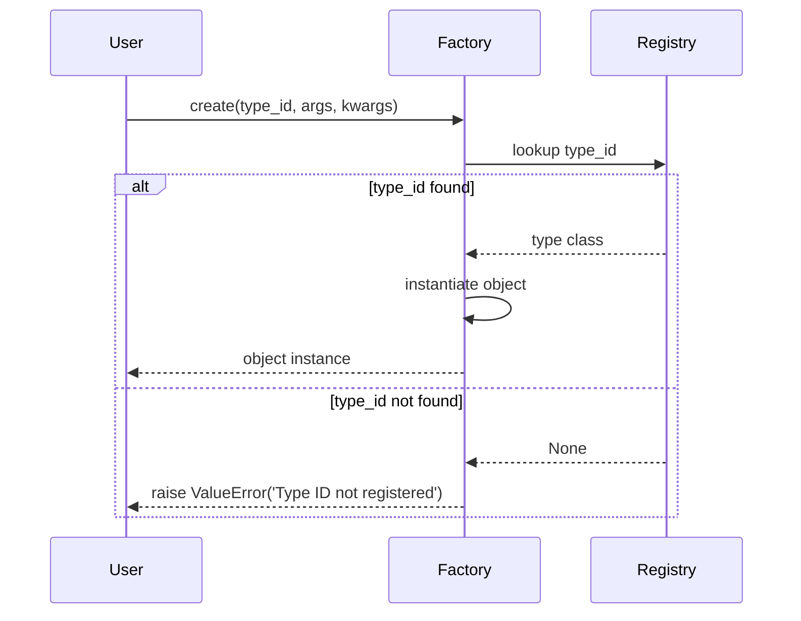

# Error Handling & Troubleshooting

Working with *Dessine-moi* involves dynamic creation of Python objects from nested dictionaries via a factory pattern. While this offers great flexibility, certain errors can arise—commonly due to unregistered types or malformed input. This documentation page guides you through the most frequent error scenarios you may encounter, showing clear examples of error messages, their causes, and best practices to handle and recover gracefully.

---

## Common Error Scenarios

### 1. Attempting to Create an Object from an Unregistered Type

When you request the factory to create an instance using a type ID not present in its registry, a `ValueError` is raised immediately.

#### Scenario
```python
obj = factory.create('unknown_type')
```

#### Typical Error Message
```
ValueError: Type ID 'unknown_type' is not registered in the factory.
```

#### Cause
The factory has no knowledge of what `unknown_type` refers to because you have not registered the corresponding class or alias.

#### Recommendations
- Ensure you have registered your custom class with a unique `type_id` before creating instances.
- Use the `register` method or decorator properly.
- Use the `alias` method if multiple names need to point to the same type.

---

### 2. Registering Duplicate Type IDs Without Overwrite

Each type ID must be unique in the factory registry. Attempting to register a new class with an already existing type ID raises a `ValueError` unless explicit overwrite is enabled.

#### Scenario
```python
factory.register(MyClass, type_id='sheep')
# Later
factory.register(AnotherClass, type_id='sheep')  # Raises
```

#### Typical Error Message
```
ValueError: Type ID 'sheep' is already registered. Use overwrite_id=True to override.
```

#### Cause
The factory enforces ID uniqueness to prevent ambiguities.

#### Recommendations
- Avoid duplicate type IDs.
- If intentional replacement is needed, set `overwrite_id=True` explicitly.
- Consider using aliases for alternative names instead of overwriting.

---

### 3. Improper Lazy Registration Strings

Lazy registration defers importing a type until instantiation by registering a type as a string like `'module.Type'`. Incorrect strings cause errors when the factory resolves them.

#### Scenario
```python
factory.register('invalidtype', type_id='bad')
obj = factory.create('bad')  # Error when loading
```

#### Typical Error Messages
- On registration: `ValueError` if string cannot be parsed as a <module>.<attribute>
- On creation: `ModuleNotFoundError` or `AttributeError` if module or attribute missing.

#### Cause
The lazy type string is expected to be a fully qualified module path with attribute naming the type.

#### Recommendations
- Use full module paths (e.g., `'datetime.datetime'`).
- Verify module and attribute exist and are importable.
- Use the `LazyType.from_str()` utility method to parse strings safely.

---

### 4. Converting Dictionaries Missing Required Fields or with Wrong Types

When using the factory converter to transform dictionaries into objects, missing expected fields or incorrect types cause `TypeError` or custom exceptions depending on your class constructors.

#### Scenario
```python
factory.convert({'type': 'sheep', 'age': 'five'})
```

#### Typical Error Message
```
TypeError: __init__() got an unexpected keyword argument 'age'
```

or
```
TypeError: invalid type for age: expected int, got str
```

#### Cause
- The dictionary lacks required keys or uses incorrect types.
- The class constructor or dict constructor rejects malformed input.

#### Recommendations
- Validate input dictionaries before conversion.
- Ensure class constructors and dict constructors handle or reject inputs explicitly.
- Use factory features like `dict_constructor` for controlled instantiation.

---

### 5. Using an Unknown or Incorrect `dict_constructor` Name

If you specify a `dict_constructor` when registering a type but the referenced class method does not exist, registration raises a `ValueError`.

#### Scenario
```python
factory.register(MyClass, type_id='myclass', dict_constructor='nonexistent_method')
```

#### Typical Error Message
```
ValueError: dict_constructor 'nonexistent_method' not found on class 'MyClass'
```

#### Cause
The method name given to `dict_constructor` must be a valid, callable class method of the registered class.

#### Recommendations
- Confirm the constructor method exists and is decorated as `@classmethod`.
- Use test instances or exploration tools to verify method presence.
- Consider fallback default constructors if no special dict constructor is needed.

---

## Strategies for Graceful Recovery & Diagnostics

- **Validate Early:** Check input dictionaries against expected schemas before converting.
- **Catch Specific Exceptions:** Trap `ValueError` to detect unregistered types and prompt user for registration.
- **Verbose Logging:** Enable detailed logging around factory operations if available to trace errors.
- **Use Aliases Carefully:** Avoid alias clashes by confirming IDs before adding aliases.
- **Test Lazy Types:** When using lazy registration, test object creation paths explicitly to verify imports.

---

## Best Practices Summary

- Always register types before creating or converting.
- Use unique type IDs and aliases judiciously.
- When converting dicts, ensure dict keys match your class field names and types.
- Prefer explicit error handling around `create()` and `convert()` calls.
- Employ factory customization for advanced error interception or logging needs.

---

## Troubleshooting Checklist

| Issue                                    | Likely Cause                        | Solution                                         |
|------------------------------------------|-----------------------------------|-------------------------------------------------| 
| `ValueError` on create with unknown type | Type ID not registered            | Register the type or correct the ID             |
| `ValueError` on register type ID exists  | Duplicate type ID with no overwrite| Use `overwrite_id=True` or choose a new ID      |
| Errors on lazy type import                | Module or attribute missing       | Verify string path and module availability      |
| `TypeError` on dict conversion            | Mismatched/missing dict fields    | Validate dict input format                        |
| `ValueError` for unknown dict_constructor | Specified method doesn’t exist    | Check method name and decorators                 |

---

## Example: Handling an Unregistered Type Error Gracefully

```python
try:
    obj = factory.create('dragon')
except ValueError as e:
    print(f"Error: {e}")
    # Register or log as necessary
```

Output:
```
Error: Type ID 'dragon' is not registered in the factory.
```

---

## Visual Flow: Factory Object Creation and Error Path



---

## Additional Resources

- For foundational usage and registration details, see [Registering Types and Building Object Trees](../guides/getting-started/registering-types.html).
- For dictionary-to-object conversion guidance, refer to [Creating Objects from Dictionaries](../guides/getting-started/dict-to-object.html).
- For advanced customization and troubleshooting techniques, consult [Performance Optimization & Troubleshooting](../guides/advanced-usage/performance-and-troubleshooting.html).
- For official API details on Factory methods and error behaviors, review the [Factory API Reference](../api-reference/core-api/factory-class.html).

---

By understanding these common errors and following the recommendations, you will unlock robust, maintainable workflows with *Dessine-moi* that gracefully accommodate unexpected input and registration scenarios, empowering dynamic Python object creation with confidence.