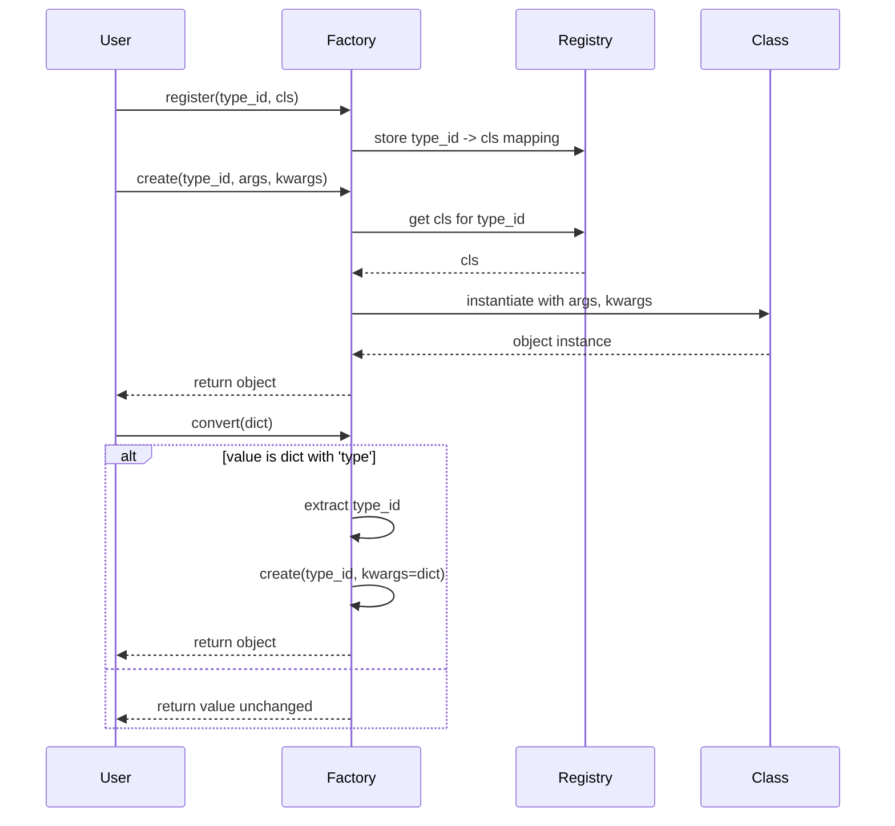

# Factory Usage Examples

Explore practical examples that guide you through the core patterns of using the **Dessine-moi** `Factory`. This page will help you understand how to create factories, register Python types, convert dictionaries into typed objects, and ultimately build rich, nested object graphs from JSON-like data.

---

## 1. Creating a Factory Instance

Begin by importing the library and instantiating a new factory. This factory will serve as your dynamic object creator and type registry.

```python
import dessinemoi

factory = dessinemoi.Factory()
print(factory.registry)  # Outputs: {}
```

The factory starts with an empty registry, ready to accept your types.

---

## 2. Registering Types with the Factory

You need to register Python classes to the factory so it knows how to instantiate objects based on type identifiers. 

### Basic Registration

Define a class and register it with a unique type ID.

```python
import attrs

@attrs.define
class Sheep:
    wool: str = 'some'

factory.register(Sheep, type_id='sheep')
print(factory.registry)
```

### Using the Factory’s Decorator for Registration

You can also register directly by decorating your class with `@factory.register`. If the class defines a `_TYPE_ID` attribute, the factory uses it automatically:

```python
@factory.register
@attrs.define
class Lamb(Sheep):
    _TYPE_ID = 'lamb'
    wool: str = 'fine'

print(factory.registry)
```

### Registering Aliases

Alias one type ID to another so the same class can be referred to by multiple IDs.

```python
factory.alias('sheep', 'mouton')
print(factory.registry)
```

Alternatively, declare aliases at registration:

```python
factory.register(Sheep, type_id='sheep', aliases=['mouton'])
```

---

## 3. Creating Instances from Registered Types

Once your types are registered, create instances either with constructor arguments or by specifying custom constructors.

### Simple Instantiation

```python
merino = factory.create('sheep', kwargs={'wool': 'lots'})
print(merino)  # Sheep(wool='lots')
```

### Restricting Allowed Types

You can keep creation restrictive so only certain subclasses are instantiated.

```python
# This will raise because 'sheep' is not allowed if only Lamb is permitted
try:
    factory.create('sheep', allowed_cls=Lamb)
except TypeError as e:
    print(e)

# Allowed when creating subtype
lamb = factory.create('lamb', allowed_cls=Sheep)
print(lamb)
```

### Using Custom Constructors

If your class has alternative class method constructors, instruct the factory to use them:

```python
@classmethod
def unsheavable(cls):
    return cls(wool='none')

Sheep.unsheavable = unsheavable

unsheared = factory.create('sheep', construct='unsheavable')
print(unsheared)  # Sheep(wool='none')
```

---

## 4. Converting Dictionaries to Objects

The `Factory.convert` method simplifies transforming a dictionary into a fully typed Python object.

- If the value is not a dictionary, it returns the value unchanged.
- If the dictionary includes a `type` key, it uses the corresponding registered type to create an object.

```python
sheep_dict = {
    'type': 'sheep',
    'wool': 'thick'
}

sheep_obj = factory.convert(sheep_dict)
print(sheep_obj)  # Sheep(wool='thick')

# Non-dictionary values pass through unmodified
unchanged = factory.convert(42)
print(unchanged)  # 42
```

### Handling Allowed Classes in Conversion

You can enforce type constraints when converting:

```python
try:
    # Raises because 'sheep' is not allowed when only Lamb is permitted
    factory.convert({'type': 'sheep'}, allowed_cls=Lamb)
except TypeError as e:
    print(e)

# Allowed conversion
lamb_obj = factory.convert({'type': 'lamb'}, allowed_cls=Lamb)
print(lamb_obj)
```

### Using Custom Dict Constructors

You may specify class method names as dict constructors during registration. This lets the factory use the custom constructor instead of the default.

```python
@attrs.define
class SheepWithConstructor:
    wool: str

    @classmethod
    def merino(cls):
        return cls(wool='lots')

factory.register(SheepWithConstructor, type_id='sheep', dict_constructor='merino')

obj = factory.convert({'type': 'sheep'})
print(obj)  # SheepWithConstructor(wool='lots')
```

---

## 5. Building Complex Object Graphs from Nested Dictionaries

Because `Factory.convert` can recurse into nested dictionaries, you can represent complex data trees and have them instantiated fully typed.

```python
@factory.register
@attrs.define
class Farm:
    sheep: list

farm_dict = {
    'type': 'farm',
    'sheep': [
        {'type': 'sheep', 'wool': 'thick'},
        {'type': 'lamb', 'wool': 'soft'}
    ]
}

farm = factory.convert(farm_dict)
print(farm)
```

This example assumes you registered `Farm` and the list of `sheep` can be converted by the factory automatically.

---

## 6. Lazy Type Registration and Import Deferral

You can register types by their fully qualified strings so actual import is deferred until creation.

```python
factory.register('datetime.datetime', type_id='datetime')

dt = factory.create('datetime', args=(2024, 6, 25))
print(dt)  # 2024-06-25 00:00:00
```

This is ideal in large projects to reduce the initial import overhead.

---

## 7. Error Handling and Common Issues

- Trying to create or convert an unregistered type ID raises a `ValueError`.
- Registering duplicate IDs without `overwrite_id=True` raises a `ValueError`.
- Restricting allowed classes will raise `TypeError` if there is a mismatch.

<Tip>
Always ensure your type IDs are unique and meaningful to avoid conflicts.
Use the `allowed_cls` argument to enforce type safety in dynamic object creation.
</Tip>

---

## 8. Practical Tips & Best Practices

- Use the `@factory.register` decorator to keep type declarations concise and consistent.
- Assign a `_TYPE_ID` class attribute to streamline registrations.
- Utilize aliases for supporting multiple naming conventions for the same type.
- Leverage class method constructors via the `construct` argument for flexible instantiation.
- Prefer lazy registration in large or plugin-based applications to optimize startup time.

---

## 9. Visual Workflow Diagram



---

## 10. Next Steps

- Explore the [Registering Types and Building Object Trees guide](https://dessinemoi.readthedocs.io/en/latest/guides/getting-started/registering-types.html) to deepen your understanding of registration.
- Learn how to convert complex nested JSON structures effectively in the [Dictionary-to-Object Guide](https://dessinemoi.readthedocs.io/en/latest/guides/getting-started/dict-to-object.html).
- Check out the [attrs Integration guide](https://dessinemoi.readthedocs.io/en/latest/guides/advanced-usage/attrs-integration.html) for leveraging the attrs library to full effect.
- For error handling strategies, see the [Error Handling & Troubleshooting](https://dessinemoi.readthedocs.io/en/latest/api-reference/usage-patterns/error-handling.html) documentation.


---

## References

- [Factory Class API Reference](https://dessinemoi.readthedocs.io/en/latest/api-reference/core-api/factory-class.html)
- [Type Registration Documentation](https://dessinemoi.readthedocs.io/en/latest/api-reference/core-api/type-registration.html)
- [Built-in Converters Reference](https://dessinemoi.readthedocs.io/en/latest/api-reference/core-api/built-in-converters.html)

<Source url="https://github.com/rayference/dessinemoi" paths={[{"path": "tests/test_dessinemoi.py", "range": "5-180"}]} />

