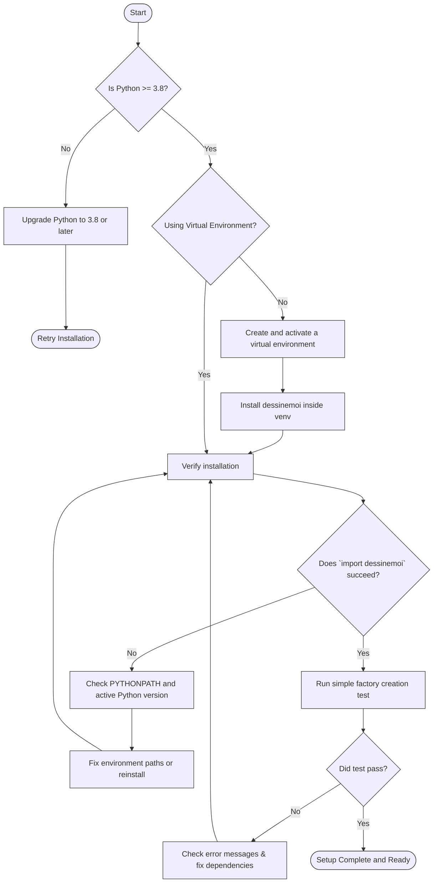

# Troubleshooting and Common Issues

This guide helps you quickly identify and resolve typical problems encountered during setup and early use of *Dessine-moi*. Whether you face dependency conflicts, path errors, or Python environment discrepancies, these practical steps will get you back on track efficiently.

---

## 1. Common Setup Problems and Solutions

### 1.1 Dependency Conflicts

*Dessine-moi* depends primarily on Python 3.8+ and the `attrs` library. Conflicts often arise when installed versions mismatch or when multiple projects interfere.

**Resolution Steps:**

1. **Verify Python Version**
   ```bash
   python --version
   ```
   Ensure it outputs `Python 3.8` or above.

2. **Check `attrs` Installation**
   ```bash
   python -c "import attrs; print(attrs.__version__)"
   ```

3. **Use a Virtual Environment**
   Create an isolated environment to avoid version conflicts:
   ```bash
   python -m venv env
   source env/bin/activate  # On Windows use `env\Scripts\activate`
   python -m pip install --upgrade pip
   python -m pip install dessinemoi
   ```

4. **Reinstall Dependencies**
   If conflicts persist, try reinstalling the requirements explicitly:
   ```bash
   pip install --force-reinstall attrs
   pip install --force-reinstall dessinemoi
   ```

<Tip>
Always activate your virtual environment before running your scripts to ensure isolation.
</Tip>

---

### 1.2 Path and Module Import Issues

Errors like `ModuleNotFoundError: No module named 'dessinemoi'` or similar indicate Python cannot find the package.

**Check the following:**

1. **Installation Verification**
   ```bash
   pip show dessinemoi
   ```
   Confirm the package details are displayed.

2. **Python Environment Consistency**
   If you have multiple Python installations, the package might be installed for a different version. Check your active Python path:
   ```bash
   which python  # or `where python` on Windows
   ```

3. **PYTHONPATH Conflicts**
   Avoid setting `PYTHONPATH` manually pointing to conflicting directories.

If developing locally (e.g., from cloned source), ensure your working directory is correct and the package is installed editable if needed:
```bash
pip install -e .
```

---

### 1.3 Python Version Mismatch

*Dessine-moi* requires **Python 3.8 or later**. Running it on older Python versions will cause syntax errors or failed imports.

**Fix it by:**

- Upgrading your Python installation.
- Using tools like `pyenv` to manage multiple Python versions.

Verify the active version:
```bash
python --version
```

Avoid executing scripts with `python2` or older aliases.

---

## 2. Verifying Your Installation

After installation or troubleshooting, confirm *Dessine-moi* is ready to use:

1. **Run Python Interactive Shell:**
   ```bash
   python
   >>> import dessinemoi
   >>> print(dessinemoi.__version__)
   ```

2. **Simple Factory Creation Test:**
   ```python
   from dessinemoi import Factory

   factory = Factory()

   class Sheep:
       _TYPE_ID = 'sheep'

       def __init__(self, name):
           self.name = name

   factory.register(Sheep)
   sheep = factory.create('sheep', args=('Dolly',))
   print(sheep.name)  # Expected output: Dolly
   ```

If all these steps succeed with no errors, your setup is correctly configured.

---

## 3. Troubleshooting Tips

### Error: `ValueError` When Registering Types

- Make sure you do not register multiple types with the same `_TYPE_ID` unless explicitly overwriting.
- Use the `overwrite_id=True` flag if intentional.

### Issue: Lazy Types Not Resolving

- Verify that lazy types specify fully qualified module and class path strings.
- Check for import errors that prevent module resolution.

### Tests Not Running or Failing

- Confirm `pytest` is installed in your environment.
- Use the provided `uv` tasks if available:
  ```bash
  uv run task test
  ```
- Check that Python version is consistent with the setup.

---

## 4. Where to Get Further Help

- **Official Documentation:** Explore the [Dessine-moi documentation](https://dessinemoi.readthedocs.io) for detailed guides and API references.
- **Usage Examples:** Visit the Getting Started guides on your first factory and configuration.
- **Source Code and Issues:** Report bugs or request help via the GitHub repository at [https://github.com/rayference/dessinemoi](https://github.com/rayference/dessinemoi).
- **Community Tools:** Use `uv` for task automation and pre-commit hooks setup as described in the contributing guidelines.

---

## 5. Summary Diagram of Troubleshooting Flow



---

By following this step-by-step guide and leveraging the tips above, you will resolve common configuration issues and be equipped to fully utilize *Dessine-moi* for your Python projects.


---

## See Also
- [Prerequisites and System Requirements](/getting-started/setup/prerequisites)
- [Installing Dessine-moi](/getting-started/setup/installation)
- [Configuration and Setup](/getting-started/setup/configuration)
- [Your First Factory: Usage Example](/getting-started/first-steps/first-factory)
- [Validating Your Installation](/getting-started/first-steps/validate-installation)

---

For bug reports or advanced help, refer to the [GitHub repository](https://github.com/rayference/dessinemoi) or join community discussions on code issues and updates.
