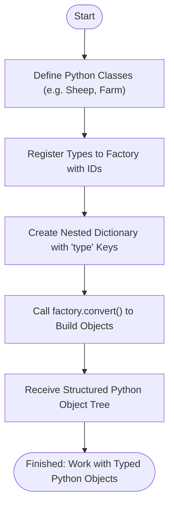

# Your First Object Tree: Quickstart Example

Welcome to Dessine-moi's hands-on introduction! This guide will take you through creating and registering a simple Python type, converting a nested dictionary to a structured object tree, and observing the result — all in just a few lines of code. You will experience how Dessine-moi transforms raw data into meaningful Python objects quickly and cleanly.

---

## 1. Define and Register Your First Type

First, you'll define a Python class representing your data and register it with a Factory instance. Dessine-moi works seamlessly with the `attrs` library for concise and immutable data classes, but it is flexible enough to work without it.

### Step 1: Define a simple Python class

Let's create a `Sheep` class with one attribute, `wool`:

```python
import attrs

@attrs.define
class Sheep:
    wool = attrs.field(default='some')
```

This class defines a sheep with default wool value `'some'`.

### Step 2: Instantiate a Factory and register the class

Create a factory instance to manage type registrations:

```python
import dessinemoi

factory = dessinemoi.Factory()
```

Register the `Sheep` class with the factory, assigning it a type ID `'sheep'`:

```python
factory.register(Sheep, type_id='sheep')
```

The registration tells the factory how to instantiate `Sheep` objects based on the `'sheep'` identifier.

<Tip>
If you prefer, you can use the `register` method as a decorator for your class, which automatically assigns the `_TYPE_ID` attribute instead of passing `type_id` explicitly.
</Tip>

## 2. Convert a Nested Dictionary into an Object

Now that we have a type registered, let's convert dictionary data into a typed object.

### Step 3: Create a nested dictionary describing the object

```python
data = {
    'type': 'sheep',
    'wool': 'lots'
}
```

The dictionary contains a `type` key specifying the type ID, and other keys corresponding to the class attributes.

### Step 4: Use the factory's `convert` method

Call `factory.convert()` with this dictionary to get a typed `Sheep` instance:

```python
sheep_obj = factory.convert(data)
```

Dessine-moi detects the `'type'` field, looks up the corresponding class, and instantiates it with the provided attributes.

### Step 5: Inspect the resulting object

Print or interact with your newly created object:

```python
print(sheep_obj)  # Output: Sheep(wool='lots')
print(type(sheep_obj))  # Output: <class '__main__.Sheep'>
```

This confirms the dictionary has been converted into a well-typed Python object.

<Check>
The expected outcome is a `Sheep` instance with `wool='lots'`.
</Check>

## 3. Extended Example: Nested Object Trees

Dessine-moi shines when dealing with nested dictionaries describing hierarchies.

### Step 6: Define additional classes and register

Let’s add a `Farm` class that contains a list of `Sheep` objects:

```python
@attrs.define
class Farm:
    name = attrs.field()
    sheep = attrs.field(factory=list)

factory.register(Farm, type_id='farm')
```

### Step 7: Prepare a nested dictionary describing a farm

```python
nested_data = {
    'type': 'farm',
    'name': 'Sunny Fields',
    'sheep': [
        {'type': 'sheep', 'wool': 'thick'},
        {'type': 'sheep', 'wool': 'medium'}
    ]
}
```

### Step 8: Convert the nested dictionary

```python
farm_obj = factory.convert(nested_data)
```

### Step 9: Verify the recursive object tree

```python
print(farm_obj)
# Farm(name='Sunny Fields', sheep=[Sheep(wool='thick'), Sheep(wool='medium')])
```

Dessine-moi recursively converts inner dictionaries/lists into registered types, building a complete object tree.

<Tip>
Ensure all involved classes (`Sheep`, `Farm`) are registered with the factory before conversion.
</Tip>

## 4. Common Pitfalls and Troubleshooting

<AccordionGroup title="Common Issues and How to Fix Them">
<Accordion title="'type' key missing in dictionary">

Dessine-moi requires a `type` key in the input dictionaries to identify which class to instantiate. Without it, `convert` returns the input unchanged.

**Solution:** Always include a `type` field matching a registered type ID.

</Accordion>
<Accordion title="Unregistered type error">

Attempting to convert a dictionary with a `type` not registered in the factory raises `ValueError`.

**Solution:** Register all types you intend to convert before calling `convert`.

</Accordion>
<Accordion title="Attribute mismatch or missing arguments">

If the dictionary has keys not matching the class init params or mandatory params missing, object creation fails.

**Solution:** Match the dictionary keys to the class constructor's keyword arguments and provide defaults as needed.

</Accordion>
</AccordionGroup>

## 5. Summary Diagram of the Process



---

## Next Steps
- Explore the guide on [Registering Types and Building Object Trees](/guides/getting-started/registering-types) to learn advanced registration and aliasing techniques.
- Try the [Creating Objects from Dictionaries](/guides/getting-started/dict-to-object) guide for deeper dictionary conversion workflows.

<Tip>
You can also revisit basic setup instructions and installation steps in Getting Started to ensure your environment matches best practices.
</Tip>

---

Happy object building with Dessine-moi!


---

## References
- [Factory Basics: Setup and Core Concepts](/guides/getting-started/factory-basics)
- [Registering Types and Building Object Trees](/guides/getting-started/registering-types)
- [Creating Objects from Dictionaries](/guides/getting-started/dict-to-object)
- [Installation Instructions](/getting-started/setup-basics/installation)
- [Basic Configuration and Import](/getting-started/first-usage/basic-setup)

<Source url="https://github.com/rayference/dessinemoi" paths={[{ path: "docs/usage.rst", range: "50-150" }, { path: "tests/test_dessinemoi.py", range: "25-100" }]} />