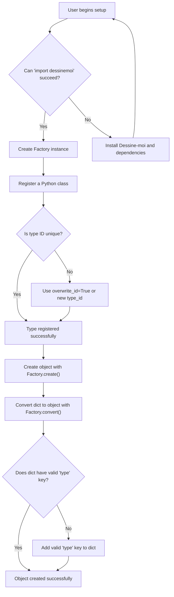

# Troubleshooting Common Setup Issues

This guide helps you quickly identify and resolve the most frequent problems encountered when setting up and using *Dessine-moi* for the first time. Whether you're facing import errors, registration conflicts, or version mismatches, these solutions will keep you moving forward confidently.

---

## 1. Import Errors on Installation

If you cannot import `dessinemoi` in your Python environment, verify these steps:

### Step-by-step Checks

1. **Verify Installation**

   Run:

   ```bash
   python -m pip show dessinemoi
   ```

   If the package is not listed, install it following the [Installation Instructions](/getting-started/setup-basics/installation).

2. **Check Python Version**

   *Dessine-moi* supports Python 3.8 and above.

   Run:

   ```bash
   python --version
   ```

   If your Python version is older, upgrade to a supported version.

3. **Check Environment**

   Ensure you are operating inside the correct virtual environment where *Dessine-moi* is installed.

4. **Confirm Import in Console**

   Launch Python shell:

   ```python
   import dessinemoi
   print(dessinemoi.__version__)
   ```

   If this raises an error, note the traceback and verify your Python path and environment.

### Troubleshooting Tips

- If the error mentions `ModuleNotFoundError`, confirm your `pip` installed the package in the right environment.
- On Windows, ensure Python has been added to system PATH.
- Use a fresh virtual environment to avoid conflicting dependencies.

---

## 2. Factory Registration Failures

When registering types to your `Factory`, common issues include:

### Duplicate Type IDs

The `Factory.register()` method will raise a `ValueError` if you try to register a type with an ID already in use.

**Resolution:**

- Explicitly allow overwrite by using `overwrite_id=True` if you intend to replace an existing registration.

  ```python
  factory.register(MyClass, type_id='mytype', overwrite_id=True)
  ```

- Alternatively, use distinct and meaningful IDs for your types to avoid collisions.

### Missing `_TYPE_ID` Attribute

If you use the decorator form of `register()` without specifying `type_id`, the registered class must define a `_TYPE_ID` attribute.

**Resolution:**

- Add a `_TYPE_ID` class attribute to your class:

  ```python
  @factory.register
  class Sheep:
      _TYPE_ID = 'sheep'
  ```

- Or register the class by passing an explicit `type_id` parameter.

### Registering Aliases

Creating an alias for an unregistered type ID will fail.

**Resolution:**

- Always register the base type first, then add aliases.

  ```python
  factory.register(Sheep, type_id='sheep')
  factory.alias('sheep', 'mouton')
  ```

---

## 3. LazyType and Deferred Imports

Using lazy registration with `LazyType` or string paths can delay class imports and might cause unexpected errors at instantiation.

### Common Issues

- **ValueError on empty or malformed lazy type string**

  The string used to declare a lazy type must be a fully qualified path including module and attribute.

- **ImportError when creating from lazy type**

  If the target module or attribute does not exist or is unavailable, creation fails.

### Solutions

- Verify your lazy type registration strings precisely:

  ```python
  factory.register('datetime.datetime', type_id='datetime')
  ```

- Confirm the module and attribute are correctly spelled and accessible.

- For complex imports, prefer eager registration to catch issues earlier.

---

## 4. Conversion Errors with Dictionaries

Problems converting dictionaries to your registered types can arise from missing or incorrect `type` keys or constructor incompatibilities.

### Missing or Invalid `type` Field

The dictionary passed to `Factory.convert()` must include a `type` key matching a registered type ID.

**Example Problem:**

```python
factory.convert({'wool': 'soft'})  # Missing 'type' key
```

**Fix:**

Include `type` in your dictionary:

```python
factory.convert({'type': 'sheep', 'wool': 'soft'})
```

### Constructor Argument Mismatches

If your type's constructor does not accept keyword arguments, conversion will fail.

**Tip:**

- Use classes designed to accept keyword arguments, like `attrs` classes.
- For custom initialization, use the `dict_constructor` parameter during registration to specify a class method.

### Allowed Class Constraints

If you set `allowed_cls` when converting or creating, ensure your dictionary type matches.

Otherwise, a `TypeError` is raised.

Example:

```python
factory.convert({'type': 'sheep'}, allowed_cls=Lamb)  # raises TypeError
```

---

## 5. Version Conflicts and Dependency Issues

### Check Installed Versions

Verify the installed version of *Dessine-moi* matches your project requirements.

```bash
python -m pip show dessinemoi
```

Check the output for the version number.

### Update Package

To upgrade to the latest version:

```bash
python -m pip install --upgrade dessinemoi
```

### Dependency Compatibility

*Dessine-moi* depends on the `attrs` package. Ensure it is installed and compatible:

```bash
python -m pip install attrs
```

If errors arise related to `attrs`, check your installed version or reinstall.

---

## 6. Common Python Environment Pitfalls

- **Multiple Python versions:** Ensure your `pip` and `python` commands refer to the same interpreter.
- **Virtual environments:** Always activate your environment before installing or running code.
- **Cached packages:** Clear pip cache if corrupt installations occur.

---

## 7. General Debugging Tips

- Use `print(factory.registry)` to inspect registered types.
- Catch and read full exception tracebacks to identify root causes.
- Refer to the [Usage Guide](/getting-started/first-usage/basic-setup) for correct API usage.

---

## 8. Getting Additional Help

- Review the [API Reference](/api-reference/core-api/factory-class) for complete method details.
- Join the community or open issues on the [GitHub repository](https://github.com/rayference/dessinemoi).
- Consult the [Developer and Contributing Guide](https://github.com/rayference/dessinemoi/blob/main/docs/contributing.md) if developing or debugging the code base.


<Check>
By following these troubleshooting steps, you will resolve setup and configuration issues swiftly, ensuring you can focus on building your Python object trees with *Dessine-moi* seamlessly.
</Check>

---

# Appendix: Quick Diagnostic Commands

```bash
# Check Dessine-moi version
python -c 'import dessinemoi; print(dessinemoi.__version__)'

# List registered factory types
python -c 'import dessinemoi; print(dessinemoi.factory.registry)'

# Test simple import
python -c 'import dessinemoi'
```

---

# Visualizing Factory Registration Flow



Use this flow to understand where issues may arise in your setup process.
