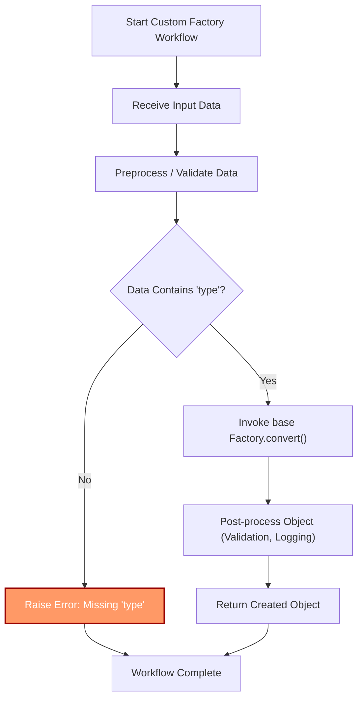

# Customizing Factories for Complex Workflows

Harness the full potential of *Dessine-moi* by tailoring factory behavior to meet sophisticated requirements. This guide walks you through the best practices for extending, subclassing, and configuring your factories to create more intricate object graphs, implement custom instantiation logic, and achieve modular, maintainable workflows.

---

## 1. Understanding the Role of Custom Factories

When your application demands more than basic registration and instantiation, customizing factories unlocks powerful workflows such as:

- Using alternative construction methods during object creation
- Introducing validation, transformation, or side effects on object instantiation
- Managing complex nested object creation with non-trivial dependencies
- Encapsulating special logic without altering your data classes

By customizing factories, you gain fine-grained control over how objects are built, ensuring your workflow reflects your domain logic faithfully.

---

## 2. Prerequisites

Before diving in, ensure:

- You have a working factory instance with basic type registrations.
- You understand core concepts around type registration, object creation, and dictionary conversion with *Dessine-moi*.
- Your data classes (often defined with `attrs`) are ready for instantiation.

Refer to the [Getting Started with Dessine-moi](https://dessinemoi.readthedocs.io/en/latest/guides/getting-started/factory-basics.html) and [Registering Types](https://dessinemoi.readthedocs.io/en/latest/guides/getting-started/registering-types.html) guides for foundational knowledge.

---

## 3. Customizing Factory Behavior: Step-by-Step

### Step 1: Subclass Factory

Start by creating a subclass of the `Factory` class to override or extend its behavior.

```python
from dessinemoi import Factory

class CustomFactory(Factory):
    pass
```


### Step 2: Override `convert` to Inject Custom Logic

The `convert` method converts dictionaries to typed objects, but you may wish to customize its behavior, e.g., handle special keys, transform input data before instantiation, or implement additional validation.

```python
class CustomFactory(Factory):
    def convert(self, value, *, allowed_cls=None):
        if isinstance(value, dict) and "special_key" in value:
            # Custom preprocessing
            value = self._process_special_key(value)
        return super().convert(value, allowed_cls=allowed_cls)

    def _process_special_key(self, value):
        # Insert custom logic here
        processed = value.copy()
        processed["processed"] = True
        return processed
```


### Step 3: Use Alternative Constructors per Type

If some classes define alternate class method constructors, configure your factory to select these during instantiation via the `construct` argument.

```python
class CustomFactory(Factory):
    def create(self, type_id, *, args=(), kwargs=None, construct=None, allowed_cls=None):
        kwargs = kwargs or {}
        # Insert additional logic or parameter injection here if needed
        return super().create(type_id, args=args, kwargs=kwargs, construct=construct, allowed_cls=allowed_cls)
```


### Step 4: Register Custom Factory and Types

Instantiate your custom factory and register types as usual.

```python
factory = CustomFactory()

@factory.register
def MyClass(...):
    ...
```

This grants you full control over the creation pipeline.


### Step 5: Compose Modular Factory Components

For complex workflows, divide customization concerns into smaller helper methods or mixins. This modular approach helps maintain clarity and promotes reuse.

```python
class LoggingMixin:
    def create(self, type_id, **kwargs):
        print(f"Creating {type_id} with args {kwargs}")
        return super().create(type_id, **kwargs)

class CustomFactory(LoggingMixin, Factory):
    pass
```


### Step 6: Testing Custom Logic

Validate your custom factory by instantiating registered types and ensuring your overrides execute as expected.

```python
instance = factory.create("my_type", kwargs={"param": 42})
print(instance)
```

---

## 4. Real-World Example: Advanced Factory with Logging and Validation

```python
from dessinemoi import Factory
import attrs

class ValidatingFactory(Factory):
    def convert(self, value, *, allowed_cls=None):
        if isinstance(value, dict):
            # Example validation before conversion
            if 'type' not in value:
                raise ValueError("Missing 'type' key in dictionary")
        obj = super().convert(value, allowed_cls=allowed_cls)
        # Post-conversion validation
        self._validate(obj)
        return obj

    def _validate(self, obj):
        if hasattr(obj, 'validate') and callable(getattr(obj, 'validate')):
            obj.validate()


@attrs.define
class Product:
    name: str
    price: float

    def validate(self):
        if self.price < 0:
            raise ValueError('Price cannot be negative')

# Instantiate factory
factory = ValidatingFactory()
factory.register(Product)  # Uses _TYPE_ID if defined or explicit type_id

# Usage
product_dict = {'type': 'Product', 'name': 'Widget', 'price': 19.99}
product = factory.convert(product_dict)  # Validates automatically

print(product)  # Product(name='Widget', price=19.99)
```

---

## 5. Tips and Best Practices

- **Keep logic focused:** Only override factory methods when needed, keep your factory classes lean.
- **Use alternate constructors:** Utilize the `construct` parameter in `create()` for flexibility.
- **Leverage aliases:** Simplify referencing types with aliases to improve readability.
- **Modularize complexity:** Separate concerns such as logging, validation, or caching in mixins or helper methods.
- **Test extensively:** Custom factories can introduce subtle bugs. Write tests to cover key object creation paths.
- **Be mindful of lazy types:** Your custom factory should handle lazy-loaded types gracefully by triggering dereferencing properly.

---

## 6. Common Pitfalls and Troubleshooting

<AccordionGroup title="Troubleshooting Custom Factory Issues">
<Accordion title="Overriding convert incorrectly">
Avoid skipping the call to `super().convert()` unless deliberately replacing core logic, as this may break nested dictionary conversions.
</Accordion>
<Accordion title="Type IDs and aliases conflicts">
Ensure no duplicate type IDs or conflicting aliases exist. Use `overwrite_id=True` intentionally when updating registrations.
</Accordion>
<Accordion title="Ignoring dict_constructor usage">
If your registered classes use `dict_constructor`, ensure your overridden methods honor this to avoid unexpected instantiation failures.
</Accordion>
<Accordion title="Validation failures not caught">
If your custom validations throw exceptions, catch and handle them appropriately during factory calls to provide user-friendly error messages.
</Accordion>
</AccordionGroup>

---

## 7. Next Steps

- Explore [attrs-integration: Converters and Automatic Object Creation](https://dessinemoi.readthedocs.io/en/latest/guides/advanced-usage/attrs-integration.html) to automate conversions with *attrs*.
- Review [Registering Types and Building Object Trees](https://dessinemoi.readthedocs.io/en/latest/guides/getting-started/registering-types.html) for deeper insights on type management.
- Consult the [Factory API Reference](https://dessinemoi.readthedocs.io/en/latest/api-reference/core-api/factory-class.html) for full method signatures and parameters.


---

## 8. Visualizing Factory Extensions



---

Harness this knowledge to make your *Dessine-moi* factory truly yours — capable of managing complex data transformations and object building workflows seamlessly.