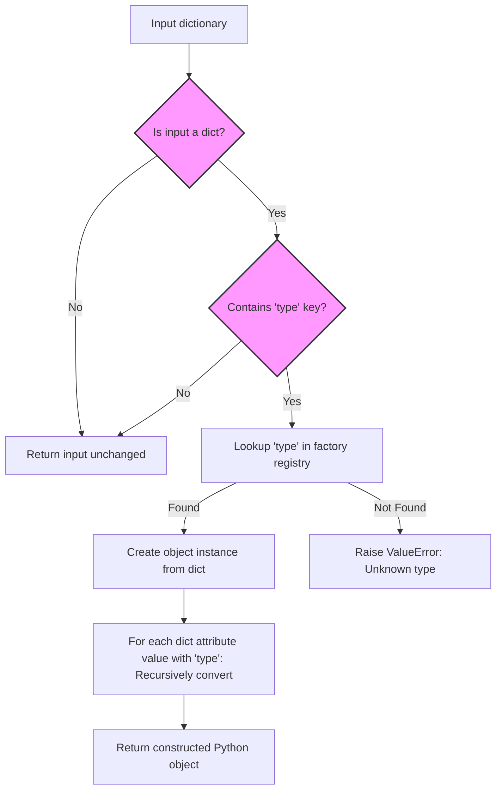

# Creating Objects from Dictionaries

Explore how Dessine-moi transforms nested dictionaries—such as those parsed from JSON—into fully-initialized Python objects. This guide focuses on typical usage patterns, supported data sources, and the structural expectations of input dictionaries to unlock the power of dynamic object creation.

---

## 1. Overview

### What This Guide Helps You Accomplish
Learn how to use Dessine-moi's Factory to convert dictionaries, including deeply nested structures, into Python objects seamlessly. Understand what dictionary formats are supported, how the factory identifies object types, and how to customize the conversion.

### Prerequisites
- Python 3.8 or higher installed
- Dessine-moi library installed and accessible
- Familiarity with Python classes, preferably with `attrs`-decorated types
- A basic factory instance initialized (see Getting Started guides)

### Expected Outcome
By following this guide, you'll confidently convert JSON-like dictionaries into fully typed Python objects, enabling dynamic data-driven workflows without manual object instantiation.

### Estimated Time
5–15 minutes for initial understanding and testing

### Difficulty Level
Beginner to Intermediate

---

## 2. How Dessine-moi Uses Dictionaries to Create Objects

### Core Concept
Dessine-moi uses the `Factory.convert` method to interpret an input value and convert it into an object:

- If the input is **not a dictionary**, the value is returned unchanged.
- If the input **is a dictionary**, the factory looks for a specific key (`type`) to determine the object's class.

The factory's internal registry maps these string `type` identifiers to Python classes.

### Typical Dictionary Structure
A dictionary intended for conversion should follow this pattern:

```python
{
  "type": "object_type_id",  # mandatory key indicates which factory-registered type to instantiate
  # Additional keys correspond to constructor parameters or attributes
  "param1": value1,
  "param2": value2,
  # [...] 
}
```

### Supported Data Sources
- **Raw Python dictionaries**
- Dictionaries parsed from JSON or YAML (typically via `json.load` or `yaml.safe_load`)
- Nested dictionaries where values can themselves be other dictionaries convertible by the factory

### Nested Object Creation
Dessine-moi supports recursive conversion of nested dictionaries:
- If attribute values are dictionaries with their own `type` keys, the factory converts them into corresponding nested objects.
- This enables dynamic creation of complex, hierarchical Python object trees from deeply nested data structures.

### Example
```python
input_dict = {
    "type": "sheep",
    "wool": "soft",
    "friend": {
        "type": "lamb",
        "wool": "very soft"
    }
}

sheep_obj = factory.convert(input_dict)
```

If `sheep` and `lamb` types are registered, `sheep_obj` will be a `Sheep` instance with a nested `friend` attribute as a `Lamb` instance.

---

## 3. Step-by-Step: Convert a Dictionary to an Object

<Steps>
<Step title="Step 1: Prepare Your Factory and Register Types">
Import Dessine-moi and create a factory instance. Register Python classes with your factory, assigning each a unique type ID.

Example:
```python
import dessinemoi
import attrs

factory = dessinemoi.Factory()

@factory.register
@attrs.define
class Sheep:
    wool: str = "some"

@factory.register
@attrs.define
class Lamb(Sheep):
    pass
```
Your factory registry now maps 'sheep' and 'lamb' to their classes.
</Step>

<Step title="Step 2: Create Input Dictionary with 'type' Keys">
Prepare a dictionary that includes a "type" key, matching the registered IDs.

Example:
```python
input_dict = {"type": "sheep", "wool": "fluffy"}
```
</Step>

<Step title="Step 3: Convert the Dictionary Using the Factory">
Use the factory's `convert()` method to create an object from the dictionary.

Example:
```python
obj = factory.convert(input_dict)
print(obj)
# Output: Sheep(wool='fluffy')
```
</Step>

<Step title="Step 4: Work with Nested Dictionary Objects">
If your dictionary includes nested dictionaries with `type` keys, the factory processes them recursively.

Example:
```python
nested_dict = {
    "type": "sheep",
    "wool": "soft",
    "friend": {"type": "lamb", "wool": "very soft"}
}

obj = factory.convert(nested_dict)
print(obj.friend)  # Lamb(wool='very soft')
```
Make sure `friend` is a valid attribute of your `Sheep` class.
</Step>

<Step title="Step 5: Handle Non-Dictionary Values">
If the input to `convert` is not a dictionary or does not have a `type` key, the value is returned unchanged.

Example:
```python
value = factory.convert(123)  # Returns 123
value = factory.convert("string")  # Returns "string"
```
</Step>
</Steps>

### Verification
- After conversion, your object should be an instance of the registered Python class matching the `type` ID
- Nested dictionaries converted into nested Python objects
- No exceptions raised during conversion if the input and registration are correct

---

## 4. Realistic Example

```python
import dessinemoi
import attrs

factory = dessinemoi.Factory()

@factory.register
@attrs.define
class Sheep:
    wool: str = attrs.field(default="some")
    friend: 'Sheep' = attrs.field(default=None)

@factory.register
@attrs.define
class Lamb(Sheep):
    pass

input_data = {
    "type": "sheep",
    "wool": "soft",
    "friend": {
        "type": "lamb",
        "wool": "very soft"
    }
}

obj = factory.convert(input_data)
print(obj)          # Sheep(wool='soft', friend=Lamb(wool='very soft', friend=None))
print(obj.friend)   # Lamb(wool='very soft', friend=None)
```

This example illustrates turning nested dictionary data into nested Python objects.

---

## 5. Tips and Best Practices

- **Always include a `type` key** in dictionaries to direct object creation
- Use **consistent and unique type IDs** when registering classes to avoid conflicts
- When using complex constructors or alternative initializations, consider specifying a **custom dict constructor** during registration
- Use **aliases** if multiple type IDs should map to the same class
- For lazy loading of types (to delay imports), register types by their fully qualified string names
- Be sure attribute names in dictionaries match constructor or attribute names in class definitions
- Consider **validation** of input dictionaries before conversion to catch missing or malformed fields

---

## 6. Troubleshooting

<AccordionGroup title="Common Conversion Issues">
<Accordion title="Factory Raises ValueError: Unregistered Type">
This error indicates your dictionary's `type` value does not match any registered class.

**Resolution:**
- Verify that the type ID in your dictionary is registered in the factory
- Check for typos or missing registrations
- Use `factory.registry` to inspect registered types
</Accordion>

<Accordion title="Incorrect Object Construction or Missing Attributes">
If your created object lacks expected attributes or nested objects are not converted, check:

- That attribute names in dictionaries match the class constructor parameters
- That nested dictionaries have valid `type` keys
- That classes support keyword-only constructor arguments (Dessine-moi requires this for conversion)
</Accordion>

<Accordion title="Unexpected Return of Original Dictionary or Value">
This means either your value was not a dictionary, or dictionary had no `type` key.

**Resolution:**
- Confirm your input dictionary contains the `type` key
- If converting nested attributes manually, ensure to recursively call the factory's convert method where needed
</Accordion>
</AccordionGroup>

---

## 7. Next Steps & Related Documentation

- Dive deeper into **Type Registration and Mapping** to manage complex type hierarchies and aliases: [Type Registration and Mapping](../api-reference/factory-core-api/type-registration)
- Explore advanced object creation mechanics and `convert` method internals: [Object Creation from Dictionaries](../api-reference/factory-core-api/object-creation-from-dict)
- Learn how to customize your factory’s behavior to adapt to unique scenarios: [Customizing the Factory](../api-reference/advanced-and-integration/custom-factory-behaviors)
- Understand integration with `attrs` converters for seamless data transformations: [Attrs-Compatible Converters](../api-reference/advanced-and-integration/attrs-converters)
- If you encounter issues during conversion, consult the error handling and troubleshooting guide: [Error Handling & Troubleshooting](../api-reference/advanced-and-integration/error-handling)

For a complete beginner’s walkthrough, start with the first steps guides:
- [Your First Factory: Usage Example](../../getting-started/first-steps/first-factory)
- [Validating Your Installation](../../getting-started/first-steps/validate-installation)

---

## 8. Additional Resources

- Official repository and code examples: [GitHub - dessinemoi](https://github.com/rayference/dessinemoi)
- `attrs` library documentation for class declarations: https://www.attrs.org/en/stable/
- JSON data parsing tutorials for preparing nested dictionaries

---

## Summary Diagram of Dictionary-Driven Object Creation



---