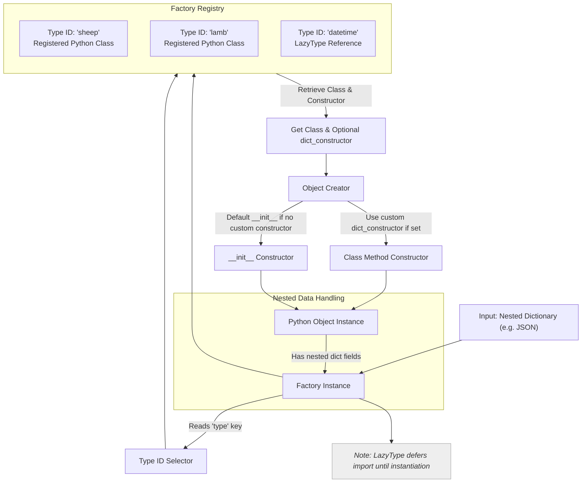

# How Dessine-moi Works (Architecture Diagram)

Understand how Dessine-moi transforms input data through its core modules and factory workflow to create Python objects. This overview combines a clear architecture diagram with a straightforward explanation to help you visualize and grasp the inner workings of your factory-based object creation.

---

## Overview: From Input Data to Python Objects

At its heart, Dessine-moi facilitates dynamic object creation using a factory pattern centered around type registration and dictionary-driven instantiation. This page visualizes how input data, primarily nested dictionaries, flows through registered factory types and results in rich Python objects corresponding to your domain models.

### The Core Workflow in a Nutshell

1. **Input Data**: You provide nested dictionaries, often representing JSON-like structures, that describe the objects you want.

2. **Registered Factory Types**: Your factory holds mappings from string type IDs to Python classes and optional custom constructors.

3. **Object Creation Process**: The factory interprets the "type" identifier in the input data to instantiate the corresponding Python object, applying any custom construction or conversion rules.

4. **Final Python Objects**: The output is a tree of Python objects, reflecting the structure and type information of the input data.

---

## Architecture Diagram

---

## Walkthrough

- **Input dictionary**: You start with a nested dictionary describing objects, each with a mandatory `type` key indicating which factory-registered Python class to instantiate.

- **Factory Registry**: The `Factory` maintains a registry mapping these type IDs (e.g., "sheep", "lamb") to Python classes or lazy references when deferred imports are desired.

- **Type selection and class retrieval**: When creating an object from input data, the factory uses the `type` key value to look up the registered class and any optional custom constructor (called `dict_constructor`).

- **Instantiation**: The factory invokes either the class's default constructor or the specified class method constructor to instantiate the object.

- **Recursive object creation**: If any attributes of the object are themselves dictionaries with types, the factory recursively processes them to build a nested object tree.

- **Lazy Loading**: For types registered lazily (by string path), the factory imports the class only when needed during the creation process, ensuring faster startup and optional imports.

---

## Practical Tips

- Ensure each input dictionary has a valid `type` key matching a registered type ID.

- Use `dict_constructor` on registered classes for customized instantiation logic, e.g., to handle initialization patterns beyond simple keyword constructors.

- Take advantage of lazy registration to reduce import overhead, especially for rarely used types.

- Use aliases in the factory registry to support multiple type IDs referencing the same class, enhancing flexibility.

- Understand that deeply nested input structures will lead to recursive factory calls, resulting in complex object graphs.

---

## Troubleshooting Common Scenarios

<AccordionGroup title="Common Questions & Issues">
<Accordion title="What happens if the type ID is missing or unknown?">
If the factory receives a dictionary without a `type` key or with an unregistered type ID, it raises a `ValueError`. Double-check input data and factory registry for accuracy.
</Accordion>
<Accordion title="How to handle classes needing positional arguments or special construction?">
Use the `dict_constructor` parameter during registration to specify a class method constructor for those cases. The factory then uses that method instead of the default constructor.
</Accordion>
<Accordion title="Can I register types without importing their modules?">
Yes. Use lazy registration by passing the full import path as a string. The actual import occurs during object creation, reducing initial overhead.
</Accordion>
<Accordion title="How are nested dictionaries handled?">
The factory calls itself recursively on nested dictionaries with `type` keys, allowing automatic conversion of nested structures into nested Python object trees.
</Accordion>
</AccordionGroup>

---

## Next Steps

- Explore the [Core Concepts & Terminology](../core-concepts-and-architecture/core-concepts) page for detailed explanations of factory internals and registry.
- Learn about [Type Registration and Mapping](../../api-reference/factory-core-api/type-registration) to master custom registrations and aliases.
- Dive into [Creating Objects from Dictionaries](../../api-reference/factory-core-api/object-creation-from-dict) for practical creation patterns.

---

Bring your nested data to life with the Dessine-moi factory, turning inputs into meaningful Python objects through a clean, extensible architecture.

---

[Back to Overview](../../overview/core-concepts-and-architecture)
